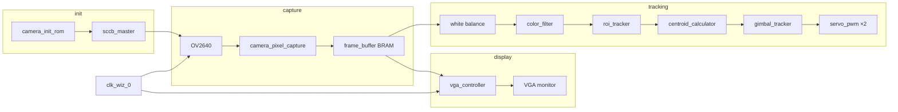

# FPGA Ball Tracker (Nexys A7)

Real-time color-based object tracking on the Digilent Nexys A7-100T. An OV2640 camera captures video, the design segments a colored ball in hardware, computes its centroid each frame, and drives pan/tilt servos to keep the target centered. Live preview is shown on the onboard VGA port.

## Features

- **OV2640** bring up over SCCB (I²C), with register settings stored in `camera_init_rom`
- **320×240** RGB444 capture into dual-port BRAM (`frame_buffer` IP)
- **640×480 VGA** output with optional 2× upscale (full screen) or native-size preview
- **Digital white balance** and optional mask overlay (switches)
- **Centroid** accumulation per frame with ROI gating for stable tracking
- **Gimbal control** via PWM servos (pan/tilt) with hardware travel limits
- **Debug LEDs** for init, camera sync, and target lock

## Hardware

| Item | Details |
|------|---------|
| FPGA board | [Digilent Nexys A7-100T](https://digilent.com/shop/nexys-a7-100t-fpga-development-board/) (`xc7a100tcsg324-1`) |
| Camera | OV2640 module (SCCB slave ID `0x60`) |
| Display | VGA on board connector |
| Actuators | Two hobby servos (pan/tilt) on **Pmod JC** |

### Pin connections (see `vivado/sobel-object-detection.srcs/constrs_1/new/cf.xdc`)

| Interface | Pmod / connector |
|-----------|------------------|
| Camera SCCB + sync + XCLK | **JA** (SCL, SDA, VSYNC, HREF, PCLK, RST, PWDN, XCLK) |
| Camera data `D[7:0]` | **JB** |
| Servo pan, tilt | **JC** pins 1–3 |
| VGA | Onboard VGA |
| Switches | SW0 = color mask overlay, SW1 = full-screen 2× scale |
| LEDs | LED0–4: init done, VSYNC, HREF, PCLK, ball valid |

Wire the camera and servos to match the constraints file before programming the bitstream.

## Architecture

**Clocks:** 100 MHz board clock → Clocking Wizard → 24 MHz `cam_xclk` and 25 MHz system/VGA clock. Pixel data is written on `cam_dclk` (async to VGA read port).

## Source layout

Hand-written RTL lives under `vivado/sobel-object-detection.srcs/sources_1/new/`:

| Module | Role |
|--------|------|
| `camera.v` | Top-level integration |
| `sccb_master.v` | SCCB master for sensor configuration |
| `camera_init_rom.v` | Register init sequence |
| `camera_pixel_capture.v` | RGB444 capture and downsampling to 320×240 |
| `vga_controller.v` | 640×480 timing and framebuffer addressing |
| `color_filter.v` | Ball segmentation (tunable chroma thresholds) |
| `roi_tracker.v` | 100×100 search window around last known position |
| `centroid_calculator.v` | Per frame center of mass |
| `gimbal_tracker.v` | Bang-bang pan/tilt with speed scaled by error |
| `servo_pwm.v` | 50 Hz servo PWM from position command |

Generated IP: `clk_wiz_0`, `frame_buffer` (Block Memory Generator).

## Usage

1. Power the board and connect VGA.
2. Wait for **LED0** (`init_led`) — camera initialization complete.
3. **SW1 (`scale_sw`)**: OFF = 320×240 preview in the top-left; ON = 2× scaled full-screen (flipped).
4. **SW0 (`color_sw`)**: ON = show white segmentation mask; OFF = color-corrected live image.
5. When a ball is locked, **LED4** (`ball_valid_led`) is on and a red crosshair marks the centroid.
6. Servos track the ball toward the image center (160, 120); limits are defined in `gimbal_tracker.v`.

### Tuning detection

Threshold comments in `color_filter.v` describe how to loosen/tighten rules for ball fill, skin rejection (`cr`), and glare (`cb`). Adjust the `low_blue`, `high_green`, `low_red`, and `bright_enough` wires until the mask is solid on the target and quiet elsewhere.